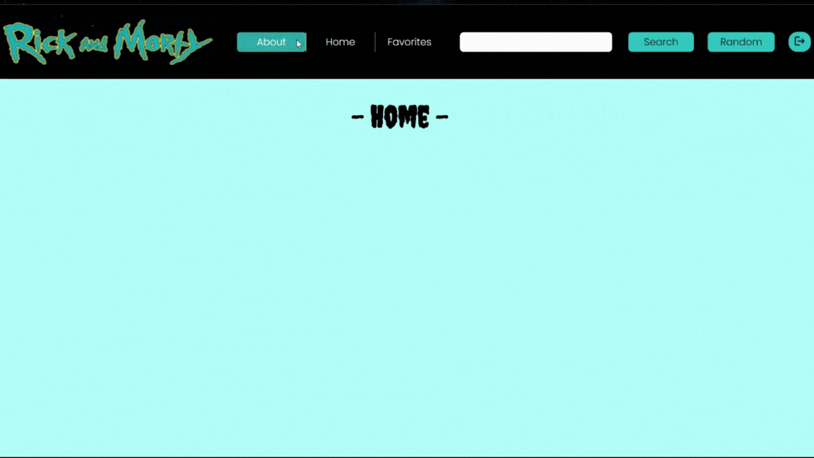
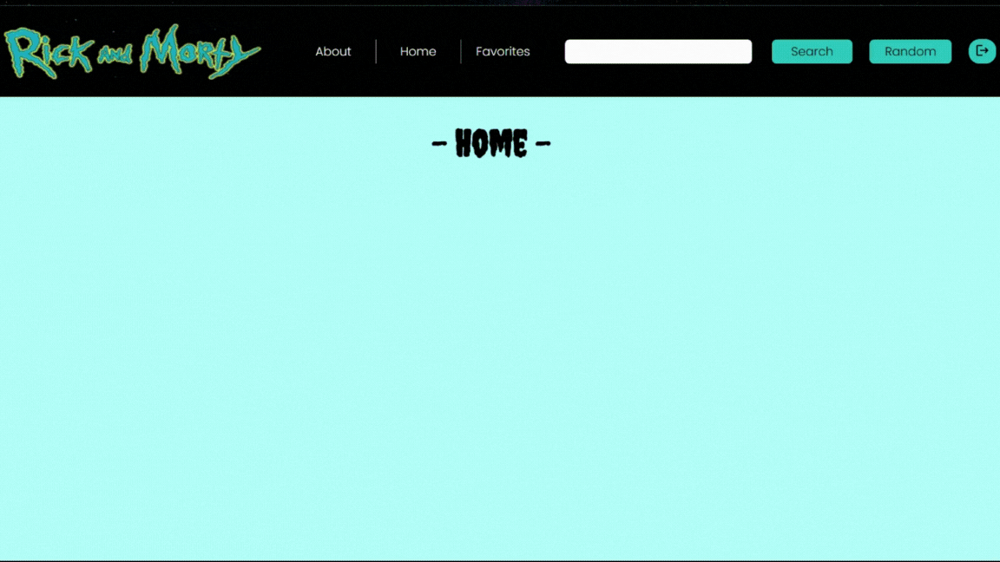

# Rick And Morty App

## 📌 About this proyect

This project was created with:
- __Front End__: React, Redux, Html, Css
- __Back End__: Node Js, Express, Sequelize
- __Database__: PostgreSQL

### 📌 How to start this page ?

This project needs a `.env` file inside the Server folder.

File structure:
- `URL_BASE='https://rickandmortyapi.com/api/character'`
- `DB_USER`
- `DB_PASSWORD`
- `PORT`
- `DB_HOST`

#### ❓ Where do I find this data?
You have to create a database on your computer with a username and password. This values are `DB_USER` and `DB_PASSWORD`.
`PORT` will be the port where your server will be running.
`DB_HOST` will be the host where your Database will be running.

📍 Then, you can run:

- In Server folder:
  - `npm install` 
  - `npm start` 

- In Client folder:
  - `npm install` 
  - `npm start` 

<!-- Open [http://localhost:3000](http://localhost:3000) to view it in your browser. -->

## 📌 Sections of this project

### Login:
You can create a new account and login to an already created account

 
    </img>

### Home:
You can search characters by id or random. Then you can delete them

 
    </img>

### About:
This section can info about me.

 
    </img>

### Logout:
Log out and return to the main page

 
    </img>

  
